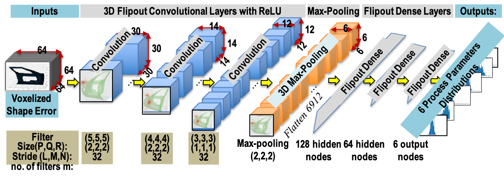
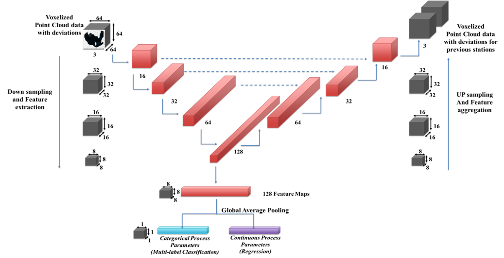
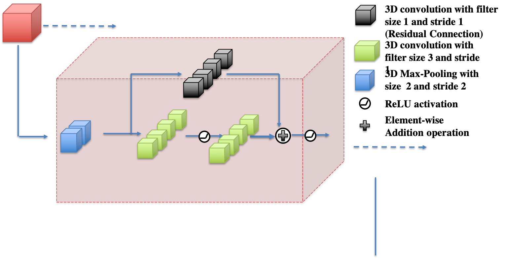
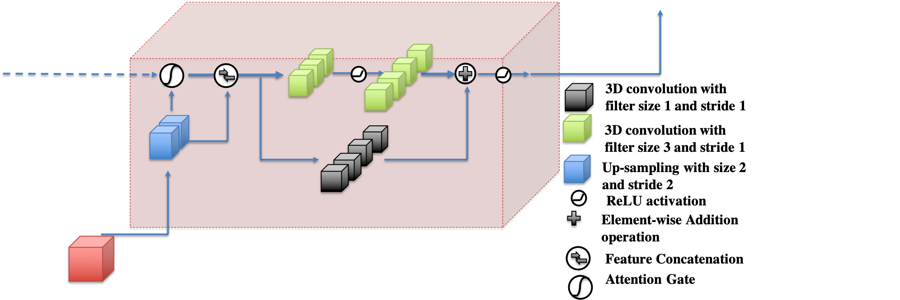

<a href="https://warwick.ac.uk/fac/sci/wmg/research/digital/dlm/" >

</a>

# Bayesian Deep Learning for Manufacturing (dlmfg)


[**Digital Lifecycle Management - In Process Quality Improvement (IPQI)**](https://warwick.ac.uk/fac/sci/wmg/research/digital/dlm/projects/ipqi_new)


[](https://doi.org/10.1117/12.2526062) [](https://lbesson.mit-license.org/) [](https://warwick.ac.uk/fac/sci/wmg/research/digital/dlm/projects/ipqi_new/) [](https://GitHub.com/Naereen/StrapDown.js/graphs/commit-activity) [](https://pypi.python.org/pypi/ansicolortags/) []() []() 


***
## Overview 
The open source **Bayesian Deep Learning for Manufacturing (dlmfg) Library** is built using a **TensorFlow**, **Tensorflow Probablity** and **Keras** back end to build Bayesian and deterministic deep learning models such as **3D Convolutional Neural Network** to enable **root cause analysis** and **quality control** in Sheet Metal Assembly Manufacturing Systems. The library can be used across various domains such as assembly systems, stamping, additive manufacturing and milling where the key problem is **Object Shape Error Detection and Estimation**. The library is build using Object Oriented Programming to enable extension and contribution from other related disciplines within the artificial intelligence community as well as the manufacturing community.

The published work can be found below: 
* [**3D convolutional neural networks to estimate assembly process parameters using 3D point-clouds**](https://www.researchgate.net/publication/333942071_3D_convolutional_neural_networks_to_estimate_assembly_process_parameters_using_3D_point-clouds)

* [**Deep learning enhanced digital twin for remote laser welding of aluminium structures**](https://www.sciencedirect.com/science/article/abs/pii/S0007850620301323)

*Other follow up papers under review*

The library consists of the following items:

1. **Datasets** -  Sheet Metal Assembly Datasets consisting of input i.e. Cloud of Point data with deviations of each node and output i.e. the process parameter variations for each of Cloud of Point. This open source dataset is the **first** dataset for sheet metal assembly manufacturing system and can be leveraged for building, training and benchmarking deep learning models for application in root cause analysis and quality control of manufacturing systems.
2. **Library Modules** - Various python modules using a TensorFlow/Keras backend for model training, deployment, visualization, sampling, active learning, transfer learning, measurement characteristics generation. More details can be found in the documentation of the library. 

## Documentation
The complete documentation and other ongoing research can be found here: [**Documentation and Research**](https://sumitsinha.github.io/Deep_Learning_for_Manufacturing/html/index.html).


## Installation
The library can be cloned using: 


    Git clone https://github.com/sumitsinha/Deep_Learning_for_Manufacturing

## Dataset Download
The datasets can be download by running the download_data.py file within the downloads file. The specifics of the download can be specified in the download\config.py file.

The library consists of the following two key datasets:

1.	[**3D Cloud of Point data with node deviations and process parameters for Single Part Car Halo Reinforcement**](https://sumitsinha.github.io/Deep_Learning_for_Manufacturing/html/case_study_halo.html) – Obtained due to variations in the Measurement Station locators and Stamping Process
2.	[**3D Cloud of Point data with node deviations and process parameters for Two part assembly for Car Door Inner and Hinge Reinforcement**](https://sumitsinha.github.io/Deep_Learning_for_Manufacturing/html/case_study_inner_rf.html) – Obtained due to variations in the Assembly System locators and joining tools.

## Deterministic Models 

The basic 3D CNN model for single stage systems termed as **PointDevNet** has the following layers:

```python

> model.add(Conv3D(32,kernel_size=(5,5,5),strides=(2,2,2),activation='relu',input_shape=(voxel_dim,voxel_dim,voxel_dim,deviation_channels)))
> model.add(Conv3D(32, kernel_size=(4,4,4),strides=(2,2,2),activation='relu'))
> model.add(Conv3D(32, kernel_size=(3,3,3),strides=(1,1,1),activation='relu')) 
> model.add(MaxPool3D(pool_size=(2,2,2)))
> model.add(Flatten())
> model.add(Dense(128,kernel_regularizer=regularizers.l2(0.02),activation='relu'))
> model.add(Dense(self.output_dimension, activation=final_layer_avt))

```
The Multi-head CNN model having multiple CNN heads depending on the number of data sources in multi-stage systems termed as **MH-PointDevNet** has the following layers:


```python

data_in=[None] * self.heads
conv_3d_1=[None] * self.heads
conv_3d_2=[None] * self.heads
conv_3d_3=[None] * self.heads
max_pool=[None] * self.heads
flat=[None] * self.heads
conv_3d_dropout_2=[None] * self.heads

for i in range(self.heads):
	data_in[i]=tf.keras.layers.Input(shape=(voxel_dim,voxel_dim,voxel_dim,deviation_channels))
			conv_3d_1[i]=tf.keras.layers.Convolution3D(32,kernel_size=(5,5,5),strides=(2,2,2),activation=tf.nn.relu)(data_in[i])
			conv_3d_2[i]=tf.keras.layers.Convolution3D(32, kernel_size=(4,4,4),strides=(2,2,2),activation=tf.nn.relu)(conv_3d_1[i])
			conv_3d_dropout_2[i]=tf.keras.layers.Dropout(0.1)(conv_3d_2[i])
			conv_3d_3[i]=tf.keras.layers.Convolution3D(32, kernel_size=(3,3,3),strides=(1,1,1),activation=tf.nn.relu)(conv_3d_dropout_2[i])
			max_pool[i]=tf.keras.layers.MaxPooling3D(pool_size=[2, 2, 2])(conv_3d_3[i])
			flat[i]=tf.keras.layers.Flatten()(max_pool[i])

merge = tf.keras.layers.concatenate(flat)
dropout_merge=tf.keras.layers.Dropout(0.2)(merge)
hidden_1=tf.keras.layers.Dense(128,kernel_regularizer=tf.keras.regularizers.l2(l=self.regularizer_coeff),activation=tf.nn.relu)(dropout_merge)
hidden_2=tf.keras.layers.Dense(64,kernel_regularizer=tf.keras.regularizers.l2(l=self.regularizer_coeff),activation=tf.nn.relu)(hidden_1)
output=tf.keras.layers.Dense(self.output_dimension)(hidden_2)

model=tf.keras.Model(inputs=data_in,outputs=output)

```
## Bayesian Models 
Motivated by the recent development of Bayesian Deep Neural Networks Bayesian CNN considering parameters to be distributions have been build using TensorFlow Probability. The Aleatoric uncertainty have been modelled using Multi-variate normal distributions as outputs while the epistemic distributions have been modelled using distributions on model parameters by using Flip-out layers.

The Bayesian version of the single station system has the following layers:


```python

> negloglik = lambda y, rv_y: -rv_y.log_prob(y)
> model = tf.keras.Sequential([
tf.keras.layers.InputLayer(input_shape=(voxel_dim,voxel_dim,voxel_dim,deviation_channels)), tfp.layers.Convolution3DFlipout(32, kernel_size=(5,5,5),strides=(2,2,2),activation=tf.nn.relu),
tfp.layers.Convolution3DFlipout(32, kernel_size=(4,4,4),strides=(2,2,2),activation=tf.nn.relu),
tfp.layers.Convolution3DFlipout(32, kernel_size=(3,3,3),strides=(1,1,1),activation=tf.nn.relu),
tf.keras.layers.MaxPooling3D(pool_size=[2, 2, 2]),
tf.keras.layers.Flatten(),
tfp.layers.DenseFlipout(128,activation=tf.nn.relu),
tfp.layers.DenseFlipout(64,activation=tf.nn.relu),
tfp.layers.DenseFlipout(self.output_dimension),
tfp.layers.DistributionLambda(lambda t: tfd.MultivariateNormalDiag(loc=t[..., :self.output_dimension], scale_diag=aleatoric_tensor)),])
model.compile(optimizer=tf.keras.optimizers.Adam(),loss=negloglik,metrics=[tf.keras.metrics.MeanAbsoluteError()])

```


## Encoder Decoder 3D U-Net Models
For scaling to multi-station systems consisting of both categorical and continuous process parameters and prediction of point-clouds (object shape error) in previous stations a 3D - Net Attention based architecture is leveraged.	



**Down-sampling Kernel**


**Attention based Up-Sampling Kernel**


```python

		def attention_block(x, g, inter_channel):

		    theta_x = Conv(inter_channel, [1,1,1], strides=[1,1,1])(x)
		    phi_g = Conv(inter_channel, [1,1,1], strides=[1,1,1])(g)
		    
		    f = Activation('relu')(add([theta_x, phi_g]))
		    psi_f = Conv(1, [1,1,1], strides=[1,1,1])(f)

		    rate = Activation('sigmoid')(psi_f)

		    att_x = multiply([x, rate])
		    return att_x

		# Down sampling
		for i in range(depth):
			out_channel = 2**i * filter_root

			# Residual/Skip connection
			res = Conv(out_channel, kernel_size=1, padding='same', use_bias=False, name="Identity{}_1".format(i))(x)

			# First Conv Block with Conv, BN and activation
			conv1 = Conv(out_channel, kernel_size=3, padding='same', name="Conv{}_1".format(i))(x)
			#if batch_norm:
				#conv1 = BatchNormalization(name="BN{}_1".format(i))(conv1)
			act1 = Activation(activation, name="Act{}_1".format(i))(conv1)

			# Second Conv block with Conv and BN only
			conv2 = Conv(out_channel, kernel_size=3, padding='same', name="Conv{}_2".format(i))(act1)
			#if batch_norm:
				#conv2 = BatchNormalization(name="BN{}_2".format(i))(conv2)

			resconnection = Add(name="Add{}_1".format(i))([res, conv2])

			act2 = Activation(activation, name="Act{}_2".format(i))(resconnection)

			# Max pooling
			if i < depth - 1:
				long_connection_store[str(i)] = act2
				x = MaxPooling(padding='same', name="MaxPooling{}_1".format(i))(act2)
			else:
				x = act2

		#Regression Outputs
		feature_vector=Conv(self.output_dimension-categorical_outputs, 1, padding='same', activation=final_activation, name='Process_Parameter_output_regression')(x)
		process_parameter_regression=GlobalAveragePooling3D(name='Regression_Outputs')(feature_vector)
		
		#Classification Outputs
		feature_vector_categorical=Conv(categorical_outputs, 1, padding='same', activation=final_activation, name='Process_Parameter_output_classification')(x)
		process_parameter_cont=GlobalAveragePooling3D()(feature_vector_categorical)
		process_parameter_classification=Activation('sigmoid',name='Classification_Outputs')(process_parameter_cont)
		
		#feature_vector=Flatten()(x)
		#process_parameter=Dense(self.output_dimension)(feature_vector)
		
		# Upsampling
		for i in range(depth - 2, -1, -1):
			out_channel = 2**(i) * filter_root

			# long connection from down sampling path.
			long_connection = long_connection_store[str(i)]

			up1 = UpSampling(name="UpSampling{}_1".format(i))(x)
			up_conv1 = Conv(out_channel, 2, activation='relu', padding='same', name="upConvSam{}_1".format(i))(up1)

			attention_layer = attention_block(x=long_connection, g=up_conv1, inter_channel=out_channel // 4)
			#  Concatenate.
			
			#up_conc = Concatenate(axis=-1, name="upConcatenate{}_1".format(i))([up_conv1, long_connection])
			up_conc = Concatenate(axis=-1, name="upConcatenate{}_1".format(i))([up_conv1, attention_layer])

			#  Convolutions
			up_conv2 = Conv(out_channel, 3, padding='same', name="upConv{}_1".format(i))(up_conc)

			up_act1 = Activation(activation, name="upAct{}_1".format(i))(up_conv2)

			up_conv2 = Conv(out_channel, 3, padding='same', name="upConv{}_2".format(i))(up_act1)

			# Residual/Skip connection
			res = Conv(out_channel, kernel_size=1, padding='same', use_bias=False, name="upIdentity{}_1".format(i))(up_conc)

			resconnection = Add(name="upAdd{}_1".format(i))([res, up_conv2])

			x = Activation(activation, name="upAct{}_2".format(i))(resconnection)

```


## Modules
The library consists of following key modules. More details about the classes, objects and methods can be found in the documentation:

* **Core** - key functions for model training, testing, data study and model deployment
* **Dynamic Learning** - key program to dynamically using the CAE simulation of the system
* **Adaptive and Dynamic Learning** - key program to dynamically learn from the CAE simulation of the system by adaptively generating samples using the uncertainty estimates of Bayesian Models
* **CAE Simulations** - Matlab based library to generate close to real samples of manufacturing systems using Multi-Physics Finite Element (FE) based models 
* **Transfer Learning** - Key functions to test state of art models (Voxnet, 3D-Unet) across different domains present in pre-trained networks and determine there application in manufacturing problems. This can also be leveraged for within domain transfer learning to check how transferable are models trained from data from one case study to another case study
* **Utilities** - key functions for model benchmarking, Voxel constructions and constructing mixture density network 
* **KMC** - key functions for generating key measurement characteristics for various process parameters within a manufacturing system
* **Visualisation** - key functions to visualise model training and cloud of point or voxelized data
* **Resources** - Resources required for model building such as Voxel mapping for Cloud-of-point data and nominal Nodes for the assembly geometry
* **Trained Models** - Consists of a file structure created for each case study that is run. This file structure consists of training and testing logs, trained models and plots
* **Pre-Trained Models** - Consists of state of the art pre-trained 3D CNN models such as Voxnet (Object Detection) and 3D U-Net (Medical Scan Segmentation)
* **Configuration** - specify the configuration parameters for different case studies and other parametrised applications such as model training, model construction, Sampling for active learning, transfer learning etc.

## Verification and Validation
Details of verification and validation of the model on an actual system can be found here: [**Real System Implementation**](https://sumitsinha.github.io/Deep_Learning_for_Manufacturing/html/real_system_implementation.html)

##### Please cite work as:

    Sinha, S., Glorieux, E., Franciosa, P., & Ceglarek, D. (2019, June). 3D convolutional neural networks to estimate assembly process parameters using 3D point-clouds. In Multimodal Sensing: Technologies and Applications (Vol. 11059, p. 110590B). International Society for Optics and Photonics.


> @inproceedings{Sinha2019,
> author = {Sinha, Sumit and Glorieux, Emile and Franciosa, Pasquale and Ceglarek, Dariusz},
> booktitle = {Multimodal Sensing: Technologies and Applications},
> doi = {10.1117/12.2526062},
> month = {jun},
> pages = {10},
> publisher = {SPIE},
> title = {{3D convolutional neural networks to estimate assembly process parameters using 3D point-clouds}},
> year = {2019}
}


<a href="https://doi.org/10.1117/12.2526062" >

</a>

##### Data generation has been done using a Multi-fidelity CAE simulation software known as VRM :

    Franciosa, P., Palit, A., Gerbino, S., & Ceglarek, D. (2019). A novel hybrid shell element formulation (QUAD+ and TRIA+): A benchmarking and comparative study. Finite Elements in Analysis and Design, 166, 103319.

##### Collaboration:
Please contact [**Sumit Sinha**](https://warwick.ac.uk/fac/sci/wmg/research/digital/dlm/people/sumit/), [**Dr Pasquale Franciosa**](https://warwick.ac.uk/fac/sci/wmg/research/digital/dlm/people/p_franciosa) 
in case of any clarifications or collaborative work with the [**Digital Lifecycle Management**](https://warwick.ac.uk/fac/sci/wmg/research/digital/dlm/) group at [**WMG**](https://warwick.ac.uk/fac/sci/wmg/), [**University of Warwick**](https://warwick.ac.uk/)
